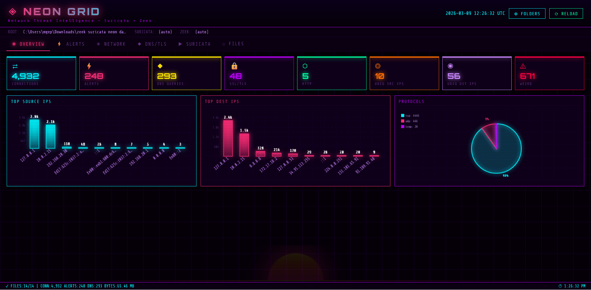
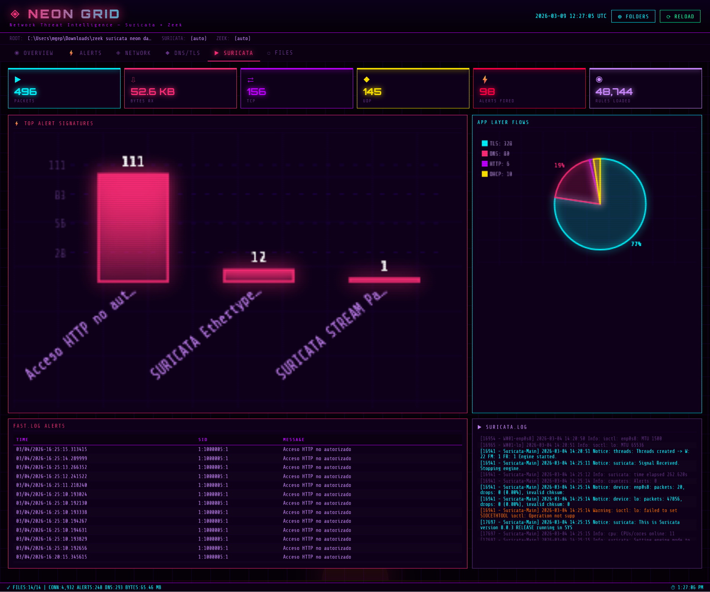
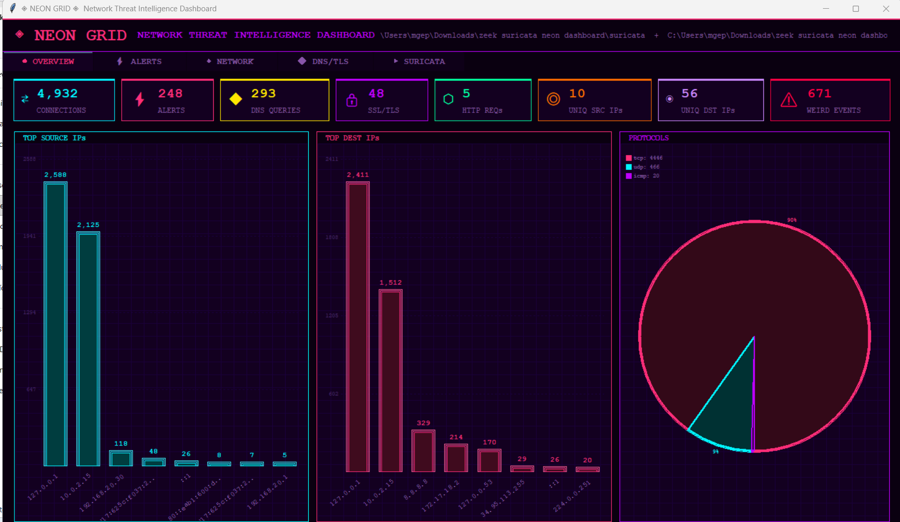
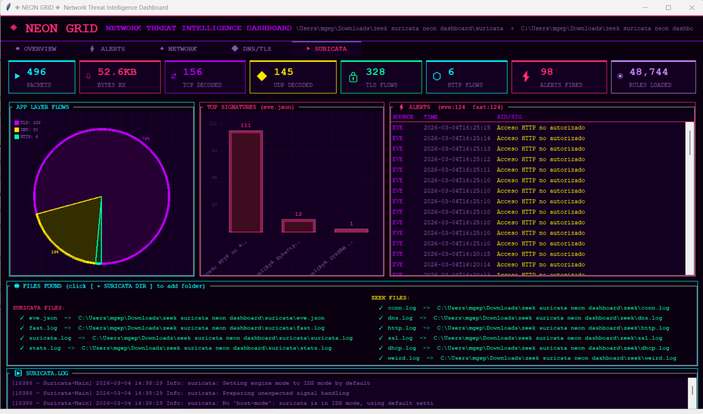

<div align="center">

# ◈ NEON GRID ◈
**Dashboard de Inteligencia de Amenazas de Red // Suricata + Zeek**

[](#)
[](#)
[](#)
[](#)

*Bienvenido a la Red.* **NEON GRID** es un analizador de logs y dashboard para **Zeek** y **Suricata** con temática *retrowave/synthwave*. Visualiza el tráfico de tu red, caza ciberamenazas y monitoriza tu mainframe con estilo.

[Características](#-características) • [Vistas Previas](#-conéctate-vistas-previas) • [Instalación](#-instalación-paso-a-paso) • [Configuración PRO](#-configuración-del-entorno-pro) • [Uso](#-manual-de-operaciones-uso)

</div>

---

---

## 🕶️ LA VISIÓN

Olvídate de los aburridos y clínicos visores de logs. NEON GRID trae la estética del *cyberpunk* de los 80s y el *outrun* a tu stack de Monitorización de Seguridad de Red (NSM). Ya sea que estés operando un SOC local, analizando un PCAP, o simplemente quieras que tu *homelab* parezca sacado de una película de hackers, NEON GRID procesa tus logs crudos (texto/JSON) y los convierte en visualizaciones espectaculares bañadas en luces de neón.

Disponible en dos versiones distintas:
1. **Edición de Escritorio:** Una interfaz gráfica (GUI) ligera y ultrarrápida impulsada por Tkinter.
2. **Edición Web:** Un dashboard para navegador impulsado por Flask, perfecto para monitorización remota.

---

## ⚡ CARACTERÍSTICAS

* **Sobrecarga de Interfaz Dual:** Elige entre una aplicación de escritorio independiente o un panel de control web.
* **Autodescubrimiento "Zero-Config":** Apunta a un directorio y automáticamente rastreará tus logs de Zeek y Suricata (soporta estructura plana o subcarpetas `zeek/` y `suricata/`).
* **Visualización de Datos Synthwave:** Gráficos de barras de neón personalizados, gráficos circulares brillantes y tablas de datos con temática retro.
* **Métricas Completas de Amenazas:**
    * Top IPs y Puertos de Origen/Destino
    * Distribuciones de Protocolos y Estados de Conexión
    * Consultas DNS y Códigos de Respuesta
    * Versiones TLS/SSL y rastreo de Certificados X.509
    * Categorías de Alertas de Suricata y Distribución de Severidad

---

## 📸 CONÉCTATE: VISTAS PREVIAS

### 🌐 Edición Web
Accede a tu inteligencia de amenazas desde cualquier lugar de la red. Cuenta con diseños responsivos dinámicos y recarga de datos.


*Fig 1: Edición Web - Visión General y Estadísticas de Red*


*Fig 2: Edición Web - Alertas de Suricata y análisis de Fast.log*

### 💻 Edición de Escritorio
Un script de Python ejecutable e independiente que utiliza Tkinter. No requiere navegador.


*Fig 3: Edición de Escritorio - Conexiones y Análisis de Protocolos*


*Fig 4: Edición de Escritorio - Flujos de Capa de Aplicación y Descubrimiento de Archivos*

---

## ⚙️ INSTALACIÓN PASO A PASO

Para que todo funcione a la perfección en tu sistema, sigue estos pasos.

**Requisitos Previos:**
* Python 3.7 o superior instalado.
* Git instalado en tu sistema.
* *Nota para usuarios Linux:* Es posible que necesites instalar Tkinter para la versión de escritorio (`sudo apt-get install python3-tk`).

### 1. Clonar el Repositorio
Abre tu terminal y descarga el código fuente a tu máquina local:
```bash
git clone [https://github.com/robertotejado/neon-grid.git](https://github.com/robertotejado/neon-grid.git)
cd neon-grid
